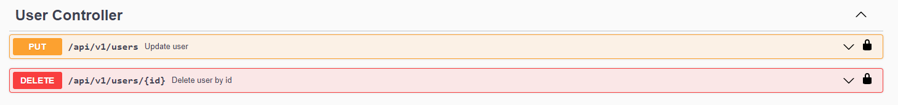

# Softtech - Patika - Java Spring Bootcamp Final Projesi

## Kullanılan Teknolojiler

- Java 11
- Spring Boot
- Spring Data JPA
- Restful API
- Swagger documentation
- MapStruct
- Lombok
- PostgreSQL
- JUnit Mockito
- Maven

## Bilgisayarınızda Çalıştırın

- Projeyi klonlayın

```bash
  git clone https://github.com/165-Softtech-Patika-Java-Spring/bitirmeprojesi-anilakd.git
```

- softtech_graduation ismi ile PostgreSQL üzerinde postgres kullanıcısı ile
database oluşturmalısınız, başka bir kullanıcı ismi kullanıyorsanız ilgili değişiklikler yapılmalıdır.
```bash  
  CREATE DATABASE softtech_graduation
    WITH 
    OWNER = postgres
    ENCODING = 'UTF8'
    CONNECTION LIMIT = -1;
```
- Proje dizininde yer alan application.properties dosyası içerisinde belirtilen alanları uygun şekilde düzenlemelisiniz.
```bash  
  spring.datasource.url=jdbc:postgresql://localhost:5432/softtech_graduation
  spring.datasource.username=postgres
  spring.datasource.password=12345
```
- Projeyi çalıştırdıktan sonra projede istenen ürün kategorilerini dosya dizininde yer alan (sql/initialize_product_category.sql) scriptini PostgreSQL üzerinde çalıştırarak eklemelisiniz.
Bunun yerine Swagger arayüzünden manuel olarak da  FOOD, STATIONARY, CLOTHES, TECHNOLOGY, CLEANING, OTHER şeklinde istenenlerde belirtilen KDV oranları ile ekleme yapılabilir.

#Ekran görüntüleri





### Bitirme Projesi

Projenin Konusu:
Bir marketteki ürünlerin satış fiyatlarına göre son fiyatlarını belirleyen servisin Spring Boot Framework kullanılarak yazılması ve isteğe bağlı olarak
önyüzünün yazılması.

> **Gereksinimler:**

> **Backend:**

- Kullanıcıdan kullanıcı adı, şifre, isim, soy isim bilgilerini alarak sisteme kayıt yapılır.
- Sisteme kayıtlı kullanıcılar market ürünlerinin veri girişini yapabilir.
- Ürün türlerine göre KDV oranları değişiklik göstermektedir. Bu oranlar aşağıdaki tabloda belirtilmiştir. __**Zaman zaman KDV oranları değişiklik
  gösterebilmektedir.**__


- Ürün için veri girişi yapacak kullanıcı; ürünün adı, ürünün türü ve vergisiz satış fiyatı alanlarını doldurur. Her bir ürün için KDV Tutarı ve ürünün son
  fiyatı da hesaplanarak sisteme kaydedilir.

> **Kurallar ve gereksinimler:**

- Sisteme yeni kullanıcı tanımlanabilir, güncellenebilir ve silinebilir.
- Sisteme yeni ürünler tanımlanabilir, güncellenebilir ve silinebilir.
- Ürünlerin fiyatları güncellenebilir.
- KDV oranları değiştiğinde sistemdeki ürünlere de bu değişiklik yansıtılmalıdır. Herhangi bir hata durumunda tüm işlemler geri alınmalıdır.
- Tüm ürünler listelenebilmelidir.
- Ürün türlerine göre ürünler listelenebilmelidir.
- Belirli bir fiyat aralığındaki ürünler listelenebilmelidir.
- Ürün türlerine göre aşağıdaki gibi detay veri içeren bir bilgilendirme alınabilmelidir.


> Validasyonlar:

- Aynı kullanıcı adı ile kullanıcı tanımı yapılamaz.
- Kullanıcı girişi kullanıcı adı & şifre kombinasyonu ile yapılır.
- Ürün türü, fiyatı, adı gibi alanlar boş olamaz.
- Ürün fiyatı sıfır ya da negatif olamaz.
- KDV oranı negatif olamaz.

> Authentication:

- Güvenli endpointler kullanınız. (jwt, bearer vs. )

> Response:

- Başarılı ve başarısız responselar için modeller tanımlayın ve bunları kullanın.

> Dökümantasyon:

- Open API Specification (Swagger tercih sebebi)

> Exception Handling:

- Hatalı işlemler için doğru hata kodlarının dönüldüğünden emin olunuz.

> Test:

- Unit ve integration testleri yazınız. 
